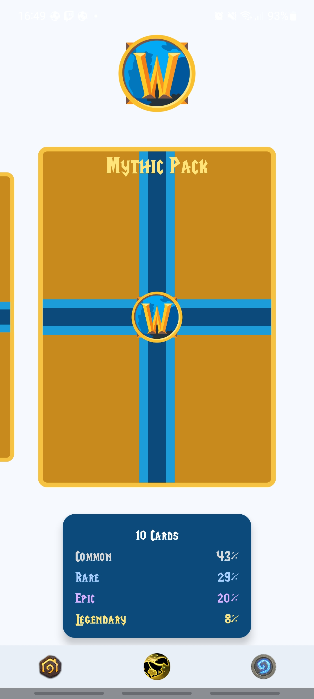
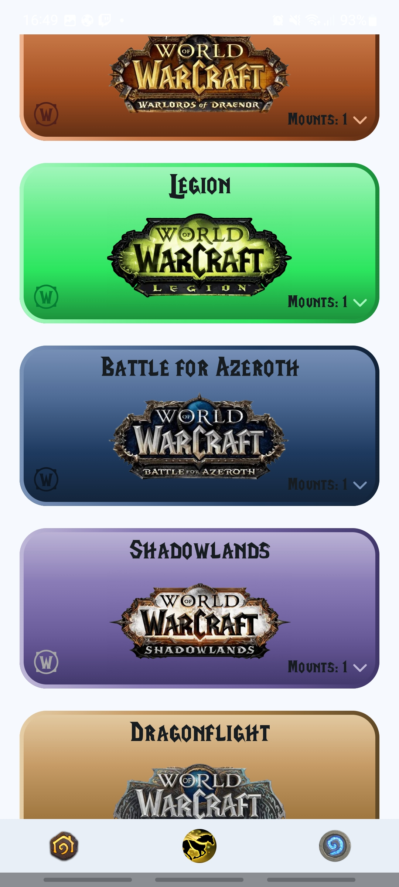
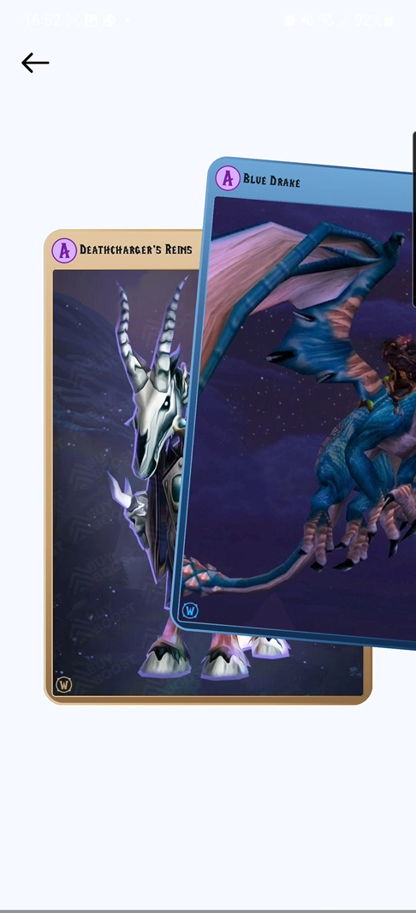

# MountVault

Proyecto personal para el desarrollo de una aplicación móvil (Android / Jetpack Compose).

Se trata de un juego de cartas donde puedes obtener **monturas** del juego World of Warcraft categorizadas por expansiones.

## 🎮 Capturas del juego

¡Mira lo que te espera al abrir un sobre!

  
  
  
  

## ✨ Características principales

- Abrir sobres de cartas con monturas de WoW.
- Monturas clasificadas por rareza: Común, Rara, Épica y Legendaria.
- Colección completa con seguimiento del progreso.
- Animaciones y efectos visuales al desbloquear monturas.
- Interfaz intuitiva y visualmente atractiva adaptada a móviles.

## 🛠️ Tecnologías utilizadas

- **Kotlin** + **Jetpack Compose**
- Android Studio – Arquitectura **MVVM**
- **Coroutines** para manejo de datos
- **DataStore** para preferencias de usuario
- **Room** para base de datos
- **Coil** para manejo de imágenes
- **Hilt** para inyección de dependencias
- **Firebase** (auth, datos y notificaciones)

## 🕹️ Cómo jugar

1. Instala la APK en tu dispositivo Android.
2. Regístrate o inicia sesión.
3. Abre sobres y completa tu colección de monturas.

## 📈 Estado del proyecto

✅ La app **MountVault está lista para jugar**.